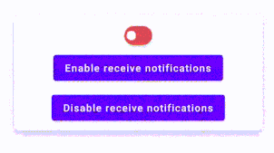

# SwitchView
[](https://opensource.org/licenses/Apache-2.0)
[](https://android-arsenal.com/api?level=14)
[](https://jitpack.io/#BasetEsmaeili/SwitchView)
[](https://forthebadge.com)


SwitchView is beautiful switch widget for Android



# Features
 **- Without third-part library**

 **- Without raw files(pictures/drawables etc...), only one Kotlin file**

 **- Android Sdk 14+**

# Usage
Add it in your root build.gradle at the end of repositories:

```Groovy
allprojects {
		repositories {
			maven { url 'https://jitpack.io' }
		}
	}
```
Add the dependency
```Groovy
dependencies {
	        implementation 'com.github.BasetEsmaeili:SwitchView:1.0'
	}
```
# How to Use Library
```xml
                <com.baset.switchview.SwitchView
                    android:id="@+id/switch_preference"
                    android:layout_width="wrap_content"
                    android:layout_height="wrap_content"
                    app:switch_elevation="8dp" />
```
# Available attributes

|            Name           |    Type   |
|:-------------------------:|:---------:|
|       animationDuration      | integer |
|       switch_on_color      | color |
|       switch_off_color      | color |
|       switch_toggle_color      | color |
|       switch_elevation      | dimension |
|       checked      | boolean |

# Register Change Listener
```kotlin
switch_preference.setOnCheckedChangeListener(object : OnCheckedChangeListener {
            override fun onCheckedChanged(view: SwitchView, isChecked: Boolean) {
                // DO SOME THING
            }
        })
```
# Change State
```kotlin
switch_preference.setChecked(true)
```
# get State
```kotlin
switch_preference.isChecked()
```
# Animation
```kotlin
switch_preference.setAnimationDuration(500)
```
# Background Color
```kotlin
switch_preference.setBackgroundColor(checkedColor,uncheckedColor)
```
# Switch Toggle color
```kotlin
switch_preference.setSwitchToggleColor(color)
```
# Elevation
```kotlin
switch_preference.setSwitchElevation(8f)
```
# Licence
```text
   Copyright [2020] [Baset Esmaeili]

   Licensed under the Apache License, Version 2.0 (the "License");
   you may not use this file except in compliance with the License.
   You may obtain a copy of the License at

       http://www.apache.org/licenses/LICENSE-2.0

   Unless required by applicable law or agreed to in writing, software
   distributed under the License is distributed on an "AS IS" BASIS,
   WITHOUT WARRANTIES OR CONDITIONS OF ANY KIND, either express or implied.
   See the License for the specific language governing permissions and
   limitations under the License.
```
# Author
**Baset Esmaeili**

Email: baset.esmaili0@gmail.com
